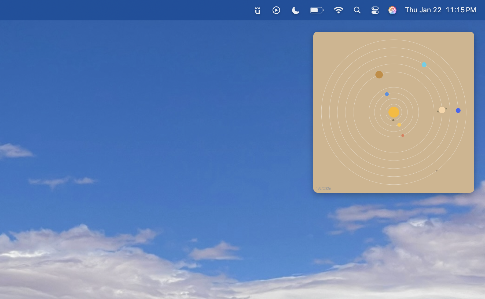

# Solar System Widget for Übersicht

A real-time solar system visualization widget displaying accurate planetary positions calculated using the Skyfield astronomy library and JPL ephemeris data.



## Features

- **Accurate planetary positions** calculated locally using Skyfield and JPL DE421 ephemeris
- **Real astronomical calculations** - positions computed from orbital mechanics, not approximations
- All 9 planets (including Pluto) with scientifically accurate colors
- Saturn's rings rendered with proper spacing
- Customizable background (tan or black)
- Minimalist design with subtle orbital paths
- Auto-updates every hour
- Works offline after initial ephemeris download

## Prerequisites

- macOS
- [Übersicht](https://tracesof.net/uebersicht/) - A desktop widget system for macOS
- Python 3 (comes pre-installed on modern macOS)
- Skyfield astronomy library

## Installation

1. **Install Übersicht** if you haven't already:
   ```bash
   brew install --cask ubersicht
   ```
   Or download from [tracesof.net/uebersicht](https://tracesof.net/uebersicht/)

2. **Install Skyfield astronomy library**:
   ```bash
   pip3 install skyfield
   ```

3. **Clone or download this widget**:
   ```bash
   cd ~/Library/Application\ Support/Übersicht/widgets/
   git clone https://github.com/carsumptive/Solar-System-Widget.git
   ```

4. **Make the fetch script executable**:
   ```bash
   chmod +x ~/Library/Application\ Support/Übersicht/widgets/Solar-System-Widget/fetch_planets.sh
   ```

5. **Run the initial position calculation**:
   ```bash
   ~/Library/Application\ Support/Übersicht/widgets/Solar-System-Widget/fetch_planets.sh
   ```
   
   *Note: On first run, Skyfield will download the JPL DE421 ephemeris file (~17MB) and cache it locally. This is a one-time download.*

6. **Refresh Übersicht** - The widget should now appear in the top-right corner of your screen

## Configuration

Open `solarsystem.jsx` and modify these settings:

### Background Color
```javascript
const BACKGROUND_COLOR = 'tan'; // Options: 'tan' or 'black'
```

### Widget Position
```javascript
export const className = `
  top: 20px;    // Distance from top
  right: 20px;  // Distance from right
  ...
```

### Widget Size
```javascript
const WIDGET_SIZE = 300; // Pixels
```

## How It Works

The widget uses a two-part system:

1. **fetch_planets.sh** - Shell script that uses Python and Skyfield to calculate current planetary positions from JPL ephemeris data and saves them to a JSON file
2. **solarsystem.jsx** - React component that reads the position data and renders an SVG visualization

The script calculates heliocentric coordinates (positions relative to the Sun) using precise orbital mechanics. The widget automatically refreshes every hour and recalculates positions daily.

### What is Skyfield?

[Skyfield](https://rhodesmill.org/skyfield/) is a Python astronomy library that computes positions for stars, planets, and satellites. It uses JPL's Development Ephemeris (DE421) - the same data NASA uses for mission planning - to calculate planetary positions with high accuracy.

## Troubleshooting

**Widget shows "No data" or "Loading":**
- Run the fetch script manually: `./fetch_planets.sh`
- Check that `planet_positions.json` exists in the Übersicht support directory
- Verify Skyfield is installed: `pip3 show skyfield`

**"Skyfield not installed" error:**
- Install it: `pip3 install skyfield`
- If using a virtual environment, make sure it's activated

**Planets not moving:**
- The fetch script runs automatically, but you can force an update by running it manually
- Check that the script has execute permissions: `chmod +x fetch_planets.sh`

**Ephemeris download fails:**
- Skyfield needs to download the DE421 ephemeris file (~17MB) on first run
- Requires internet connection for initial download
- After download, everything runs offline
- Downloaded files are cached in `~/Library/Caches/skyfield/`

**Widget not appearing:**
- Refresh Übersicht: Right-click the Übersicht menu bar icon → Refresh All Widgets
- Check Console.app for JavaScript errors

**Permission errors when running via Launch Agent:**
- Make sure the cache directory exists: `mkdir -p ~/Library/Caches/skyfield`
- The script sets `SKYFIELD_DATA_DIR` to ensure proper permissions

## Planet Colors

- Mercury: Brown (#8C7853)
- Venus: Yellow-orange (#FFC649)
- Earth: Blue (#4A90E2)
- Mars: Red-orange (#E27B58)
- Jupiter: Tan (#C88B3A)
- Saturn: Pale gold (#FAD5A5)
- Uranus: Cyan (#4FD0E7)
- Neptune: Deep blue (#4166F5)
- Pluto: Gray-brown (#A89078)

## Credits

- Planetary calculations using [Skyfield](https://rhodesmill.org/skyfield/) by Brandon Rhodes
- Ephemeris data from [NASA JPL Development Ephemeris DE421](https://naif.jpl.nasa.gov/pub/naif/generic_kernels/spk/planets/)
- Built for [Übersicht](https://tracesof.net/uebersicht/) by Felix Hageloh

## License

MIT License - Feel free to modify and share!